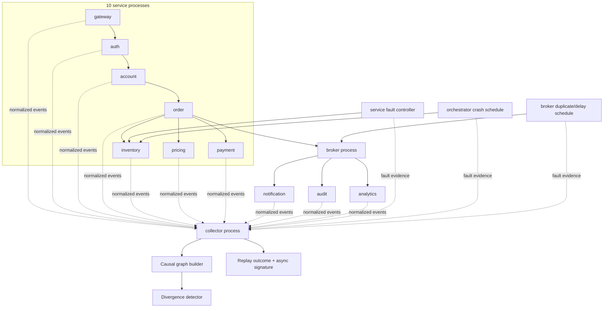
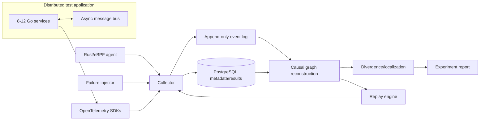

# Architecture

## Design principles

Kestrel is built around four priorities, in order:

1. correctness of recorded evidence;
2. observability of Kestrel itself;
3. reproducible measurement;
4. optimization based on profiling.

The system must never infer stronger causality or replay guarantees than the evidence supports.

## Current architecture

The current vertical slice runs **12 independent OS processes**: 10 application services, one asynchronous broker, and one Kestrel collector. Services communicate over HTTP/TCP, propagate W3C `traceparent`, and export normalized evidence through bounded asynchronous exporter queues. The collector validates events, assigns a global ingestion sequence, exposes queue/drop/error metrics, and serves experiment events to the graph/replay pipeline.

### Current boundaries

- Each application service, broker, and collector is a separate OS process, but the demo still runs on one host over loopback TCP.
- Trace propagation uses standards-compliant W3C `traceparent`, while span/event emission is a lightweight Kestrel implementation rather than the OpenTelemetry SDK.
- The broker is a real separate network process with a bounded queue. It supports two broker-owned fault slices for `orders.completed`: duplicated fan-out after synchronously recording injector evidence, and a positive fixed delivery delay with no jitter. It is not durable and does not implement controlled message reordering.
- Service exporters and collector ingestion are bounded; queue saturation is observable through drop/error counters. Before evidence is judged, the multi-process harness uses an explicit active-handler/exporter drain barrier rather than sleep timing.
- The live collector store is in-memory, but completed experiments are committed to immutable versioned artifact directories with NDJSON events plus manifest/event SHA-256 checks. PostgreSQL indexing is not implemented yet.
- Five fault slices are replay-tested in the current v2 corpus: service-local latency and TCP reset, orchestrator-owned pre-request inventory crash, broker-owned duplicate `orders.completed` delivery, and broker-owned delayed `orders.completed` delivery.
- No kernel/eBPF evidence is collected yet.
- Level-B schedule replay is exercised by the integration corpus for those five slices. Controlled message ordering (Level C) is not implemented.

These are measured implementation boundaries, not claims about the target architecture.

### Evidence-drain and broker observability

The standalone collector exposes accepted/stored/invalid/dropped counts, queue depth/capacity, cumulative storage latency, overload behavior, and health/stats/metrics/event endpoints.

Service-side exporters track sent/dropped/error/queued/pending state and retry transient collector delivery within bounds. Services expose a non-business telemetry flush barrier used by the integration harness.

For duplicate injection, collector acceptance of the fault event is a precondition for enqueueing the faulty delivery. This prevents Kestrel from creating an unrecorded duplicate incident. Delayed-message validation separately requires correlated publish/consume timing evidence and unchanged expected delivery multiplicity; it does not claim arbitrary timing determinism.

## Target architecture

### Planned component responsibilities

**Application services**
- propagate W3C trace context and explicit request/event identifiers;
- emit OpenTelemetry spans with an allowlisted attribute set;
- preserve correlation across asynchronous messages.

**Collector**
- receive OTel, eBPF, injector, replay, and application-log evidence;
- validate/normalize source-specific payloads;
- expose queue depth, drop count, ingest rate, write latency, and storage errors;
- write experiment metadata transactionally and high-volume events efficiently.

**Rust/eBPF agent**
- collect only kernel/process/network events that add evidence not already present in traces;
- attach process/socket identifiers sufficient for correlation without capturing payload bodies;
- measure and expose event-loss behavior.

**Graph builder**
- create only evidence-backed edges;
- tag inferred/ambiguous edges separately when inference is eventually introduced;
- retain provenance for every edge.

**Replay engine**
- consume recorded inputs, timing/order metadata, and fault schedules;
- declare the exact supported replay level for each incident;
- emit machine-comparable external and fault-specific evidence signatures.

## Normalized event model

Current fields:

- `id`, `sequence`;
- `source`, `kind`;
- `trace_id`, `span_id`, `parent_span_id`, `correlation_id`;
- `service`, `operation`;
- `timestamp`, `status`;
- `attributes`.

The model favors a small stable envelope plus source-specific attributes over a prematurely huge schema. The persisted experiment wrapper is versioned independently; future event-envelope changes must introduce explicit compatibility rules instead of silently changing stored semantics.

## Causality and ambiguity

Current graph edges are created only for explicit evidence:

- parent spans resolved by the same `trace_id` plus matching `parent_span_id`/`span_id` identity;
- exact message ID publish/consume match;
- explicit fault target followed by an affected-service span when such a span exists.

Duplicate `(trace_id, span_id)` identities are rejected rather than allowing one event to overwrite another as a parent target. Duplicate delivery preserves the original message ID, so one publisher can have multiple explicit consume edges; the tested duplicate incident produces six message edges. A pre-request crash has no inventory request span, so the graph does not invent a synthetic node merely to create a fault edge.

Important limitations:

- clocks can differ once services become separate processes/hosts;
- temporal order alone is not sufficient to prove causality;
- TCP retransmission or scheduling events may correlate with a trace without proving application-level causation;
- fan-out/duplicate messages naturally produce one-to-many edges;
- missing telemetry can create false graph gaps.

Future inferred edges must carry confidence/provenance rather than being mixed silently with explicit edges.

## Replay comparison and divergence

External replay comparison uses classification, HTTP status, terminal service, error code, and causal path. Kestrel additionally computes a canonical `orders.completed` message-delivery signature containing publish count and consume counts per service while excluding generated IDs/timestamps. Duplicate-message replay requires async-delivery parity because that incident preserves a successful HTTP outcome. Delayed-message replay additionally checks correlated publish/consume timing against the configured minimum delay while keeping delivery multiplicity unchanged.

Span localization uses multiple separately recorded healthy executions to build empirical timing/count envelopes and compares failing application evidence without reading injector truth. Returned divergences retain exact healthy/failing application event provenance, and terminal-service localization can include the external outcome anchor. Async message topology is compared separately with empirical `(topic, action, service)` count envelopes and explicit healthy-run provenance, including zero-count absence evidence for unexpected flows. The emitted heuristic confidence score is auditable but is not a calibrated probability.

These remain conservative regression mechanisms, not generalized root-cause or localization-accuracy claims. Richer topology diffs, retry/message-order changes, kernel anomaly features, broader independent evaluation samples, and calibrated confidence remain future work.

## Security boundary

Kestrel should not become a packet sniffer or secret store by accident.

Production defaults will require:

- no request/response payload capture unless explicitly allowlisted;
- header/attribute denylist + allowlist support;
- hashing/tokenization of selected identifiers where raw values are unnecessary;
- bounded retention per experiment;
- documented sampling behavior;
