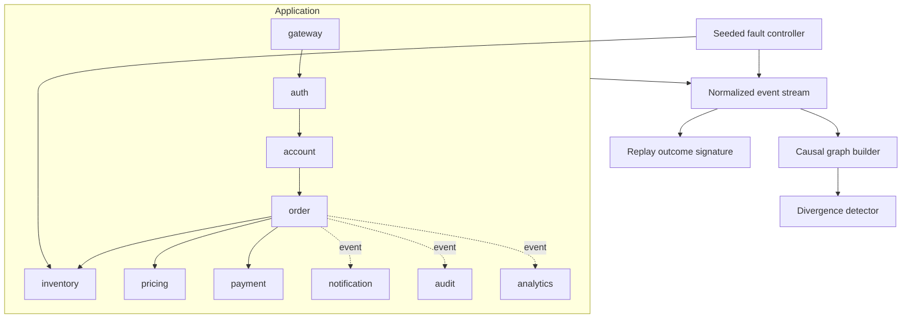
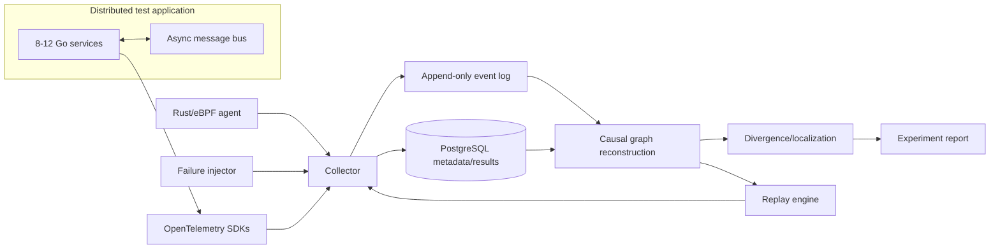

# Architecture

## Design principles

Kestrel is built around four priorities, in order:

1. correctness of recorded evidence;
2. observability of Kestrel itself;
3. reproducible measurement;
4. optimization based on profiling.

The system must never infer stronger causality or replay guarantees than the evidence supports.

## Current architecture

The first vertical slice is intentionally compact. Ten logical application services communicate through local HTTP TCP listeners. A recorder normalizes application/fault events, a graph builder reconstructs explicit causal edges, and replay compares outcome signatures from fresh executions driven by the same fault schedule.

### Current boundaries

- HTTP traffic uses real loopback TCP sockets, but all listeners live in one process.
- The asynchronous path is a Go goroutine/fan-out rather than a durable broker.
- Trace/span propagation is Kestrel-native header propagation, not OpenTelemetry yet.
- Events are held in memory for one experiment.
- No kernel events are collected yet.

These are development constraints, not claims about the target architecture.

## Target architecture

### Planned component responsibilities

**Application services**
- propagate W3C trace context and explicit request/event identifiers;
- emit OpenTelemetry spans with an allowlisted attribute set;
- preserve correlation across asynchronous messages.

**Collector**
- receive OTel, eBPF, injector, replay, and application-log evidence;
- validate/normalize source-specific payloads;
- expose queue depth, drop count, ingest rate, write latency, and storage errors;
- write experiment metadata transactionally and high-volume events efficiently.

**Rust/eBPF agent**
- collect only kernel/process/network events that add evidence not already present in traces;
- attach process/socket identifiers sufficient for correlation without capturing payload bodies;
- measure and expose event-loss behavior.

**Graph builder**
- create only evidence-backed edges;
- tag inferred/ambiguous edges separately when inference is eventually introduced;
- retain provenance for every edge.

**Replay engine**
- consume recorded inputs, timing/order metadata, and fault schedules;
- declare the exact supported replay level for each incident;
- emit a machine-comparable outcome signature.

## Normalized event model

Current fields:

- `id`, `sequence`;
- `source`, `kind`;
- `trace_id`, `span_id`, `parent_span_id`, `correlation_id`;
- `service`, `operation`;
- `timestamp`, `status`;
- `attributes`.

The model favors a small stable envelope plus source-specific attributes over a prematurely huge schema. Schema evolution/versioning will be added before persistent storage is introduced.

## Causality and ambiguity

Current graph edges are created only for explicit evidence:

- known parent span ID;
- exact message ID publish/consume match;
- explicit fault target followed by an affected-service span.

Important limitations:

- clocks can differ once services become separate processes/hosts;
- temporal order alone is not sufficient to prove causality;
- TCP retransmission or scheduling events may correlate with a trace without proving application-level causation;
- fan-out messages can produce one-to-many message edges;
- missing telemetry can create false graph gaps.

Future inferred edges must carry confidence/provenance rather than being mixed silently with explicit edges.

## Divergence algorithm: current version

The first implementation compares healthy and failing application spans by `(service, operation)`.

1. It ignores explicit fault-injector events during localization so the answer is not trivially copied from the injector.
2. It searches for large local duration differences above a configured threshold and ranks the strongest delta.
3. If no latency anomaly exists, it falls back to topology/status changes.

This is an evidence heuristic, not a final root-cause algorithm. The later version should operate over graph structure, retry/message-order changes, kernel anomalies, and a healthy-run distribution rather than a single reference execution.

## Security boundary

Kestrel should not become a packet sniffer or secret store by accident.

Production defaults will require:

- no request/response payload capture unless explicitly allowlisted;
- header/attribute denylist + allowlist support;
- hashing/tokenization of selected identifiers where raw values are unnecessary;
- bounded retention per experiment;
- documented sampling behavior;
- least-privilege eBPF capabilities and host assumptions;
- explicit threat model for multi-tenant environments.
