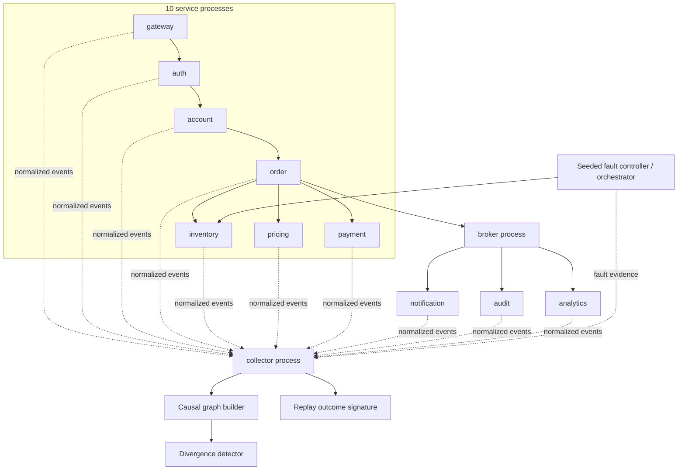
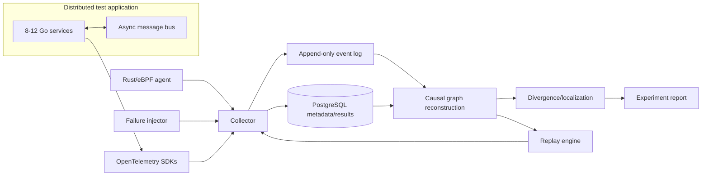

# Architecture

## Design principles

Kestrel is built around four priorities, in order:

1. correctness of recorded evidence;
2. observability of Kestrel itself;
3. reproducible measurement;
4. optimization based on profiling.

The system must never infer stronger causality or replay guarantees than the evidence supports.

## Current architecture

The current vertical slice runs **12 independent OS processes**: 10 application services, one asynchronous broker, and one Kestrel collector. Services communicate over HTTP/TCP, propagate W3C `traceparent`, and export normalized evidence through bounded asynchronous exporter queues. The collector validates events, assigns a global ingestion sequence, exposes queue/drop/error metrics, and serves experiment events to the graph/replay pipeline.

### Current boundaries

- Each application service, broker, and collector is a separate OS process, but the demo still runs on one host over loopback TCP.
- Trace propagation uses standards-compliant W3C `traceparent`, while span/event emission is a lightweight Kestrel implementation rather than the OpenTelemetry SDK.
- The broker is a real separate network process with a bounded queue, but it is not durable and does not yet support controlled reordering/duplication faults.
- Service exporters and collector ingestion are bounded; queue saturation is observable through drop/error counters instead of blocking indefinitely. Before evidence is judged, the multi-process harness uses an explicit active-handler/exporter drain barrier so request-local telemetry has reached the collector rather than relying on sleep timing.
- The live collector store is in-memory, but completed experiments are committed to immutable versioned artifact directories with NDJSON events plus manifest/event SHA-256 checks. PostgreSQL indexing is not implemented yet.
- Three fault slices are currently implemented and replay-tested: latency, TCP connection reset, and an orchestrator-owned pre-request inventory service crash. Latency/reset execute inside the service fault controller; service crash is deliberately process-lifecycle logic in the orchestrator and is rejected by the in-service controller.
- No kernel/eBPF evidence is collected yet.
- Level-B replay is proven by the integration corpus for the tested latency/timeout, TCP-reset, and pre-request inventory-crash paths. The default terminal demo currently presents the latency path.

These are measured implementation boundaries, not claims about the target architecture.

### Collector observability

The standalone collector exposes:

- accepted/stored/invalid/dropped event counts;
- queue depth and capacity;
- cumulative storage latency;
- HTTP `429` overload behavior with `Retry-After`;
- `/healthz`, `/v1/stats`, `/metrics`, and trace-filtered event retrieval.

The service-side exporter separately tracks sent, dropped, error, queued, and pending delivery state. Transient collector-delivery failures receive bounded retries, and services expose a non-business telemetry flush barrier used by the integration harness. The broker reports queued/in-flight/delivered/error counts. Completed experiment artifacts form the restart boundary for graph/replay analysis; see `docs/EXPERIMENT_FORMAT.md`.

## Target architecture

### Planned component responsibilities

**Application services**
- propagate W3C trace context and explicit request/event identifiers;
- emit OpenTelemetry spans with an allowlisted attribute set;
- preserve correlation across asynchronous messages.

**Collector**
- receive OTel, eBPF, injector, replay, and application-log evidence;
- validate/normalize source-specific payloads;
- expose queue depth, drop count, ingest rate, write latency, and storage errors;
- write experiment metadata transactionally and high-volume events efficiently.

**Rust/eBPF agent**
- collect only kernel/process/network events that add evidence not already present in traces;
- attach process/socket identifiers sufficient for correlation without capturing payload bodies;
- measure and expose event-loss behavior.

**Graph builder**
- create only evidence-backed edges;
- tag inferred/ambiguous edges separately when inference is eventually introduced;
- retain provenance for every edge.

**Replay engine**
- consume recorded inputs, timing/order metadata, and fault schedules;
- declare the exact supported replay level for each incident;
- emit a machine-comparable outcome signature.

## Normalized event model

Current fields:

- `id`, `sequence`;
- `source`, `kind`;
- `trace_id`, `span_id`, `parent_span_id`, `correlation_id`;
- `service`, `operation`;
- `timestamp`, `status`;
- `attributes`.

The model favors a small stable envelope plus source-specific attributes over a prematurely huge schema. The persisted experiment wrapper is versioned independently; future event-envelope changes must introduce explicit compatibility rules instead of silently changing stored semantics.

## Causality and ambiguity

Current graph edges are created only for explicit evidence:

- known parent span ID;
- exact message ID publish/consume match;
- explicit fault target followed by an affected-service span.

A pre-request service crash is an important boundary case: the killed service has no request span, so there is no affected-service node to attach a fault edge to. The fault event remains recorded evidence, but graph construction does not invent a synthetic request span simply to create an edge.

Important limitations:

- clocks can differ once services become separate processes/hosts;
- temporal order alone is not sufficient to prove causality;
- TCP retransmission or scheduling events may correlate with a trace without proving application-level causation;
- fan-out messages can produce one-to-many message edges;
- missing telemetry can create false graph gaps.

Future inferred edges must carry confidence/provenance rather than being mixed silently with explicit edges.

## Divergence algorithm: current version

The current implementation compares healthy and failing application spans by `(service, operation)` while deliberately ignoring explicit injector events during localization.

1. It first searches for large local duration differences above a configured threshold and ranks the strongest delta, because propagated parent errors are often consequences rather than the first useful local evidence.
2. When an externally observed outcome identifies a terminal service, the detector can use that service as an application-evidence anchor. If the healthy terminal-service span is absent from the failing run, it reports `missing_span`; if the span exists but changes status, it reports `terminal_status_change`.
3. It then falls back to generic unexpected-span, status-change, or missing-span topology differences.

The terminal-service anchor comes from the machine-readable outcome signature, not from the fault-injector event. This allows the crash case to localize a missing `inventory/check` span without trivially copying the configured crash target.

This remains an evidence heuristic, not a final root-cause algorithm. The later version should operate over graph structure, retry/message-order changes, kernel anomalies, and a healthy-run distribution rather than a single reference execution.

## Security boundary

Kestrel should not become a packet sniffer or secret store by accident.

Production defaults will require:

- no request/response payload capture unless explicitly allowlisted;
- header/attribute denylist + allowlist support;
- hashing/tokenization of selected identifiers where raw values are unnecessary;
- bounded retention per experiment;
- documented sampling behavior;
- least-privilege eBPF capabilities and host assumptions;
- explicit threat model for multi-tenant environments.
