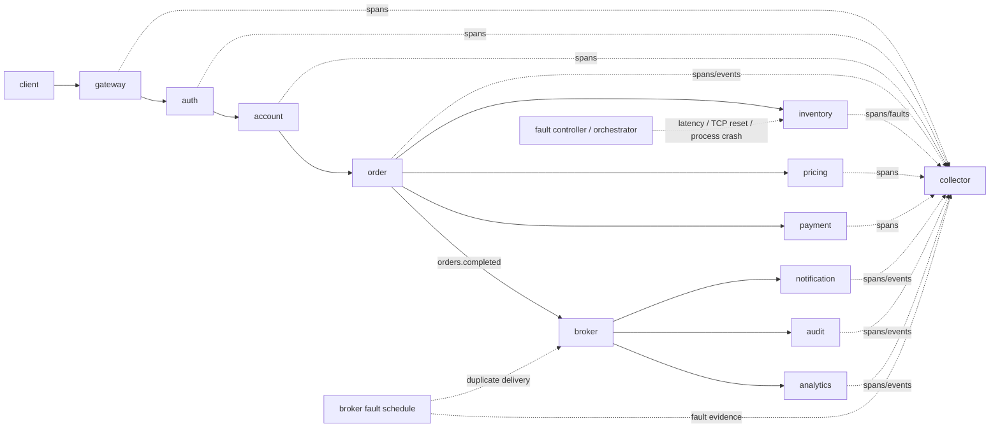

# Kestrel — Deterministic Failure Replay for Distributed Systems

Kestrel is a distributed-systems flight recorder and replay project. Its goal is to correlate application traces with low-level runtime/network evidence, reconstruct causal execution graphs, identify where failing executions first diverge from healthy ones, and replay the classes of failures for which the recorded evidence is sufficient.

> **Status: active engineering project, not yet resume-ready.** The repository now contains a tested multi-process vertical slice: 10 service processes, a separate asynchronous broker, a standalone bounded collector, W3C `traceparent` propagation, normalized events, seeded latency, real TCP connection-reset, orchestrated real-process crash, and broker duplicate-message injection, causal graph reconstruction, evidence-based divergence detection, and Level-B failure-schedule replay for four supported fault slices. OpenTelemetry SDK instrumentation, PostgreSQL metadata indexing, Rust/eBPF telemetry, containerized deployment, broader crash/network/async fault coverage, and publishable performance benchmarks are still pending. Completed incidents are persisted as versioned, checksum-verified experiment artifacts for restart-safe graphing and replay, with guarded stale-writer recovery after abrupt process death.

Kestrel deliberately does **not** claim that arbitrary distributed executions can be made deterministic. Replay semantics are scoped and measured per supported fault class.

## Why this exists

Traditional distributed tracing is excellent at showing application spans, but many production failures involve evidence outside a span: connection failures, retransmissions, socket lifecycle, process exits, scheduler delays, or timing/order interactions. Kestrel is designed around a normalized evidence stream where application, kernel, fault-injector, replay, and log events can be correlated without pretending every relationship is perfectly known.

## Current vertical slice



The default demo launches each logical service as a separate OS process, plus separate broker and collector processes, over loopback TCP. An older in-process harness remains available as a fast unit-level development path via `make demo-inprocess`. The topology is not containerized yet.

## Quick start

Requirements: Go 1.23+.

```bash
make demo
```

The default terminal demo uses the latency case and performs healthy, failing, and replay executions. It persists the failing execution as an immutable experiment artifact, discards live failing state, reloads the artifact, reconstructs the graph/evidence, and replays from the recorded schedule.

Re-run a persisted artifact independently with:

```bash
make artifact-replay ARTIFACT=.kestrel/experiments/<experiment-id>
```

Run the full multi-process integration corpus—including latency, TCP reset, service crash, and duplicate async delivery—with:

```bash
make integration
```

Exact durations and event counts are runtime measurements and are intentionally not hard-coded as benchmark claims.

## Supported fault slices

### Latency → timeout

A seeded delay at `inventory/check` exceeds the order service's dependency timeout. The recorded/replayed outcome is HTTP 504 with terminal service `inventory` and error code `inventory_timeout`.

### TCP connection reset

The inventory service hijacks the accepted HTTP connection and forces TCP reset semantics rather than returning an HTTP error. Kestrel records both the injector event and an errored inventory span with `transport.error=connection_reset`. The tested recorded/replayed outcome is HTTP 502 with terminal service `inventory` and error code `inventory_connection_reset`.

### Service crash

Kestrel starts a healthy topology, records a pre-request `service_crash` schedule, kills the actual inventory child process, verifies unavailability, and then sends the workload. The tested recorded/replayed outcome is HTTP 502 with terminal service `inventory` and error code `inventory_connection_refused`. Because inventory is dead before request arrival, crash localization reports the missing healthy `inventory/check` span using persisted application evidence and the external terminal-service outcome rather than copying the injector target.

The current crash scope is deliberately narrow: `inventory`, pre-request, `trigger_on_match=1`, with Unix-oriented process-lifecycle testing.

### Duplicate async message

The current async slice targets `broker/orders.completed`. Before duplicating an envelope, the broker requires the collector to accept explicit injector evidence tied to the original message ID. It then delivers the same envelope twice to notification, audit, and analytics while preserving the message ID.

The synchronous request still succeeds with HTTP 201, so HTTP outcome equality is not enough. Kestrel derives a canonical async-delivery signature that counts one publish and consumes per service while ignoring generated IDs/timestamps. The tested incident records one publish and two consumes at each worker, and its graph contains six publish→consume edges. A separate artifact-replay process must reproduce both the external outcome and this async-delivery signature.

This is duplicate-delivery schedule replay, not controlled message-order replay. Delayed and reordered message faults remain pending.

Fault kinds declared for future work but not implemented are rejected during validation rather than silently becoming no-ops. Service crash is orchestrator-owned; duplicate message is broker-owned; latency/reset remain service-local.

## What is recorded today

The normalized event schema currently supports source/kind, trace/span/correlation identifiers, service/operation, timestamp/status, arbitrary string attributes, asynchronous message IDs and publish/consume actions, and injector metadata including fault kind, target, seed, trigger/schedule information, and fault-specific parameters.

The schema is intentionally source-neutral so OpenTelemetry and eBPF events can enter the same causal pipeline later.

## Durable experiment artifacts

Completed experiments are stored as `manifest.json` + `events.ndjson` + `checksums.json`. The manifest is schema-versioned; both manifest and event bytes are SHA-256 checked on reload; experiment IDs are path-safe and immutable through the storage API. Multi-process integration tests prove that a separate replay process can reconstruct recorded evidence and reproduce supported incidents using only the artifact path and a fresh node binary.

Abrupt writer death can leave a reservation and deterministic temporary directory. Cleanup is deliberately guarded rather than automatic: Kestrel requires a staleness threshold, same-host ownership, and a confirmed-dead PID before deleting uncommitted writer state. Use `make artifact-recover EXPERIMENT=<id>`; committed artifact directories are never mutated by recovery.

This is not PostgreSQL yet, and the checksums provide corruption detection rather than cryptographic authenticity. See [docs/EXPERIMENT_FORMAT.md](docs/EXPERIMENT_FORMAT.md).

## Causal graph and divergence evidence

Current edges include parent-span edges, message publish→consume edges, and fault→affected-span edges where recorded temporal evidence supports them. Duplicate delivery naturally produces multiple message edges from one publisher. A pre-request crash produces no affected inventory request span, so the graph does not invent one merely to connect the fault event.

The divergence layer can additionally use an externally observed terminal service to distinguish a status change from a healthy span that is entirely missing in the failing execution. It does not inspect the injector event to select that service.

A graph edge or divergence result represents recorded evidence, not metaphysical certainty. See [ARCHITECTURE.md](ARCHITECTURE.md).

## Replay semantics

The current implementation supports **Level B — failure schedule replay** for four tested slices:

- latency: replay target/trigger/seed/delay/jitter configuration;
- connection reset: force the recorded dependency TCP reset in a fresh topology;
- service crash: replay the recorded pre-request inventory process-kill schedule;
- duplicate message: replay the broker duplicate-delivery schedule and require canonical per-consumer async-delivery parity.

`kestrel-artifact-replay` requires semantic equality of the external outcome signature and the canonical `orders.completed` message-delivery signature. For synchronous failures, the async signature is naturally empty; for duplicate delivery, it is the critical evidence that distinguishes the fault from a healthy HTTP 201 result. See [REPLAY_SEMANTICS.md](REPLAY_SEMANTICS.md).

## Development commands

```bash
make test
make vet
make check
make integration
make demo
make demo-inprocess
make artifact-replay ARTIFACT=.kestrel/experiments/<id>
make artifact-recover EXPERIMENT=<id>
make benchmark
```

CI runs `go test ./...` and `go vet ./...` on every push and pull request.

## Benchmark status

There are **no publishable throughput, overhead, replay-rate, or root-cause-localization numbers yet**. The benchmark methodology and the gate for promoting a number into the README or a résumé bullet live in [BENCHMARKS.md](BENCHMARKS.md).

Target numbers such as 25k+ req/s, <4.20% p95 overhead, or >95% supported-fault replay success remain engineering targets until measured reproducibly.

## Security posture

The current slice records identifiers and metadata only; it does not record request bodies. The production design will default to metadata allowlists/redaction, bounded retention, explicit sampling, and documented eBPF privilege requirements. See [ARCHITECTURE.md](ARCHITECTURE.md#security-boundary).

## Roadmap

The living implementation sequence is tracked in [docs/IMPLEMENTATION_PLAN.md](docs/IMPLEMENTATION_PLAN.md). Major remaining slices include OpenTelemetry-native application instrumentation, PostgreSQL metadata/results indexing and retention/migration policy, Rust/eBPF evidence, broader async/process/network fault replay, containerized deployment, and reproducible performance/localization benchmarking.

## Documentation

- [ARCHITECTURE.md](ARCHITECTURE.md)
- [FAILURE_MODEL.md](FAILURE_MODEL.md)
- [REPLAY_SEMANTICS.md](REPLAY_SEMANTICS.md)
- [BENCHMARKS.md](BENCHMARKS.md)
- [DEVELOPMENT.md](DEVELOPMENT.md)
- [docs/IMPLEMENTATION_PLAN.md](docs/IMPLEMENTATION_PLAN.md)
- [docs/EXPERIMENT_FORMAT.md](docs/EXPERIMENT_FORMAT.md)

## Resume gate

Kestrel will not be described as complete until it has a reproducible end-to-end demo, actual replay across a meaningful failure corpus, causal graph visualization, meaningful low-level telemetry, tests/CI, measured performance, and traceable benchmark artifacts. Every numeric résumé claim must map to a reproducible entry in `BENCHMARKS.md`.
