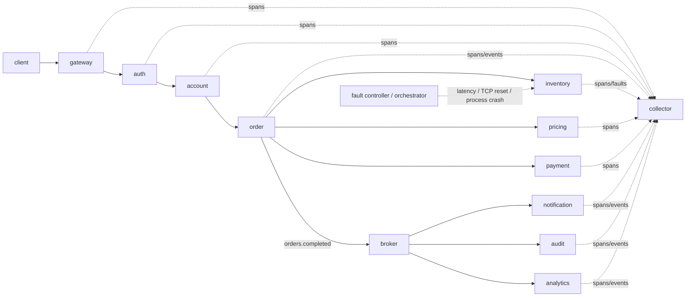

# Kestrel — Deterministic Failure Replay for Distributed Systems

Kestrel is a distributed-systems flight recorder and replay project. Its goal is to correlate application traces with low-level runtime/network evidence, reconstruct causal execution graphs, identify where failing executions first diverge from healthy ones, and replay the classes of failures for which the recorded evidence is sufficient.

> **Status: active engineering project, not yet resume-ready.** The repository now contains a tested multi-process vertical slice: 10 service processes, a separate asynchronous broker, a standalone bounded collector, W3C `traceparent` propagation, normalized events, seeded latency, real TCP connection-reset, and orchestrated real-process crash injection, causal graph reconstruction, evidence-based divergence detection, and Level-B failure-schedule replay for all three supported fault slices. OpenTelemetry SDK instrumentation, PostgreSQL metadata indexing, Rust/eBPF telemetry, containerized deployment, a broad fault corpus, and publishable performance benchmarks are still pending. Completed failures are persisted as versioned, checksum-verified experiment artifacts for restart-safe graphing and replay, with guarded stale-writer recovery after abrupt process death.

Kestrel deliberately does **not** claim that arbitrary distributed executions can be made deterministic. Replay semantics are scoped and measured per supported fault class.

## Why this exists

Traditional distributed tracing is excellent at showing application spans, but many production failures involve evidence outside a span: connection failures, retransmissions, socket lifecycle, process exits, scheduler delays, or timing/order interactions. Kestrel is designed around a normalized evidence stream where application, kernel, fault-injector, replay, and log events can be correlated without pretending every relationship is perfectly known.

## Current vertical slice



The default demo launches each logical service as a separate OS process, plus separate broker and collector processes, over loopback TCP. An older in-process harness remains available as a fast unit-level development path via `make demo-inprocess`. The topology is not containerized yet.

## Quick start

Requirements: Go 1.23+.

```bash
make demo
```

The default terminal demo uses the latency case and performs three executions:

1. healthy request;
2. request with a seeded latency fault at `inventory/check`;
3. replay with the same failure schedule.

It persists the failing execution as an immutable experiment artifact, discards the live failing result, reloads the artifact, builds the failing causal graph, compares healthy/failing application evidence, and replays from the recorded fault schedule.

Example shape of the output:

```text
Kestrel multi-process demo
==========================
topology: 10 service processes + broker + collector
healthy outcome: success (...)
failing outcome: inventory/inventory_timeout (...)
causal graph: nodes=... edges=...
divergence evidence: {"service":"inventory","operation":"check","reason":"latency_delta",...}
replay outcome: inventory/inventory_timeout (...)
replay_match=true
```

The output also prints the artifact directory and event-log SHA-256. Re-run that artifact independently with:

```bash
make artifact-replay ARTIFACT=.kestrel/experiments/<experiment-id>
```

Run the full multi-process fault/replay integration corpus, including latency, real TCP reset, and real inventory-process crash cases, with:

```bash
make integration
```

Exact durations and event counts are runtime measurements and are intentionally not hard-coded as benchmark claims.

## Supported fault slices

### Latency → timeout

A seeded delay at `inventory/check` exceeds the order service's dependency timeout. The recorded/replayed outcome is HTTP 504 with terminal service `inventory` and error code `inventory_timeout`.

### TCP connection reset

The inventory service hijacks the accepted HTTP connection and forces TCP reset semantics rather than returning an HTTP error. Kestrel records both the injector event and an errored inventory span with `transport.error=connection_reset`. The order service distinguishes an actual reset from a deadline expiry; the tested recorded/replayed outcome is HTTP 502 with terminal service `inventory` and error code `inventory_connection_reset`.

### Service crash

The current crash slice is orchestrator-owned. Kestrel starts a healthy topology, records a pre-request `service_crash` schedule, kills the actual inventory child process, confirms its health endpoint is unavailable, and then sends the workload. The order service observes a real refused TCP connection; the tested recorded/replayed outcome is HTTP 502 with terminal service `inventory` and error code `inventory_connection_refused`.

Because inventory is dead before the request arrives, the failing run contains no `inventory/check` request span. The crash localization test compares healthy and persisted failing application evidence and reports the missing terminal-service span without reading the injector event for the answer. A separate artifact-replay process repeats the process-kill schedule against a fresh topology and must reproduce the recorded semantic outcome.

The currently supported crash scope is intentionally narrow: `inventory`, pre-request, `trigger_on_match=1`, with Unix-oriented process-lifecycle testing. General mid-request crashes, restarts, and Kubernetes lifecycle replay are not claimed.

Fault kinds that are declared for future work but not implemented are rejected during spec validation instead of silently becoming no-ops. Service crash is accepted by the experiment/orchestrator layer but rejected by the in-service fault controller because process lifecycle is orchestrator-owned.

## What is recorded today

The normalized event schema currently supports:

- source and event kind;
- trace ID, span ID, parent span ID, and correlation ID;
- service and operation;
- timestamp and status;
- arbitrary typed-as-string attributes;
- asynchronous message IDs and publish/consume actions;
- failure-injector metadata including fault kind, target, seed, schedule phase, and injected parameters.

The schema is intentionally source-neutral so OpenTelemetry and eBPF events can enter the same causal pipeline later.

## Durable experiment artifacts

Completed experiments are stored as `manifest.json` + `events.ndjson` + `checksums.json`. The manifest is schema-versioned; both manifest and event bytes are SHA-256 checked on reload; experiment IDs are path-safe and immutable through the storage API. Multi-process integration tests prove that a separate replay process can reconstruct recorded evidence and reproduce the saved outcome using only the artifact path and a fresh node binary.

Abrupt writer death can leave a reservation and deterministic temporary directory. Cleanup is deliberately guarded rather than automatic: Kestrel requires a staleness threshold, same-host ownership, and a confirmed-dead PID before deleting an uncommitted writer's state. Use `make artifact-recover EXPERIMENT=<id>`; committed artifact directories are never mutated by recovery.

This is not PostgreSQL yet, and the checksums provide corruption detection rather than cryptographic authenticity. See [docs/EXPERIMENT_FORMAT.md](docs/EXPERIMENT_FORMAT.md).

## Causal graph and divergence evidence

Current edges include:

- parent span → child span;
- message publish → message consume;
- injected fault → affected service span when temporal evidence supports that link.

For a pre-request crash there is no affected inventory span to connect to the injector node. The divergence layer therefore has a separate conservative path: after checking for local latency anomalies, it can use the externally observed terminal service from the outcome signature to distinguish a terminal-service status change from a healthy span that is entirely missing in the failing execution. It does not inspect the fault event to select that service.

A graph edge or divergence result represents recorded evidence, not metaphysical certainty. Ambiguity and unsupported causality are documented in [ARCHITECTURE.md](ARCHITECTURE.md).

## Replay semantics

The current implementation supports **Level B — failure schedule replay** for three tested classes:

- latency: replay the recorded seed, target, trigger position, delay, and jitter configuration;
- connection reset: replay the recorded target/trigger/seed and force the same dependency connection reset in a fresh topology;
- service crash: replay the recorded pre-request inventory process-kill schedule in a fresh topology.

Replay success is semantic equality of the recorded and replayed outcome signatures, which include failure classification, HTTP status, terminal service, error code, and causal path. See [REPLAY_SEMANTICS.md](REPLAY_SEMANTICS.md).

## Development commands

```bash
make test       # unit + integration/replay tests
make vet        # static checks
make check      # test + vet
make integration # full multi-process fault/replay corpus
make demo       # build/run the 12-process latency healthy/failure/replay demo
make demo-inprocess # fast legacy in-process harness
make artifact-replay ARTIFACT=.kestrel/experiments/<id>
make artifact-recover EXPERIMENT=<id> # guarded cleanup of stale writer state
make benchmark  # development microbenchmark only
```

CI runs `go test ./...` and `go vet ./...` on every push and pull request.

## Benchmark status

There are **no publishable throughput, overhead, replay-rate, or root-cause-localization numbers yet**. The benchmark methodology and the gate for promoting a number into the README or a résumé bullet live in [BENCHMARKS.md](BENCHMARKS.md).

Target numbers such as 25k+ req/s, <4.20% p95 overhead, or >95% supported-fault replay success remain engineering targets until measured reproducibly.

## Security posture

The current slice records identifiers and metadata only; it does not record request bodies. The production design will default to metadata allowlists/redaction, bounded retention, explicit sampling, and documented eBPF privilege requirements. See [ARCHITECTURE.md](ARCHITECTURE.md#security-boundary).

## Roadmap

The living implementation sequence is tracked in [docs/IMPLEMENTATION_PLAN.md](docs/IMPLEMENTATION_PLAN.md). The next major engineering slices are:

- OpenTelemetry-native application instrumentation (the standalone collector is already implemented);
- PostgreSQL metadata/results indexing plus retention and schema-migration policy;
- Rust/eBPF network/process telemetry with a demonstrated incremental debugging benefit;
- expanded seeded fault corpus and replay classes;
- Docker Compose/Kubernetes deployment;
- benchmark harness, profiling, optimization, and measured results.

## Documentation

- [ARCHITECTURE.md](ARCHITECTURE.md)
- [FAILURE_MODEL.md](FAILURE_MODEL.md)
- [REPLAY_SEMANTICS.md](REPLAY_SEMANTICS.md)
- [BENCHMARKS.md](BENCHMARKS.md)
- [DEVELOPMENT.md](DEVELOPMENT.md)
- [docs/IMPLEMENTATION_PLAN.md](docs/IMPLEMENTATION_PLAN.md)
- [docs/EXPERIMENT_FORMAT.md](docs/EXPERIMENT_FORMAT.md)

## Resume gate

Kestrel will not be described as complete until it has a reproducible end-to-end demo, actual replay across a meaningful failure corpus, causal graph visualization, meaningful low-level telemetry, tests/CI, measured performance, and traceable benchmark artifacts. Every numeric résumé claim must map to a reproducible entry in `BENCHMARKS.md`.
