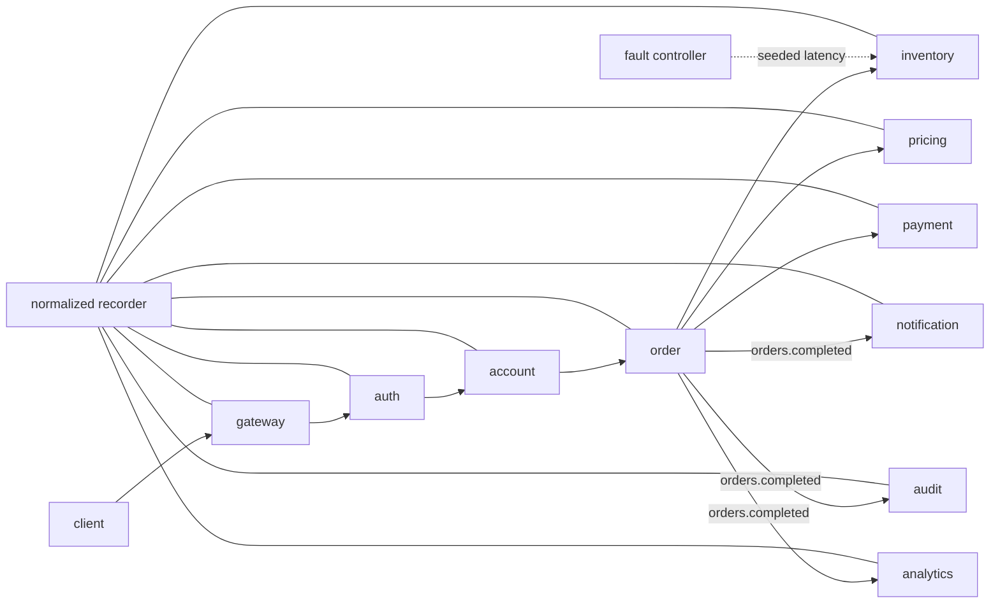

# Kestrel — Deterministic Failure Replay for Distributed Systems

Kestrel is a distributed-systems flight recorder and replay project. Its goal is to correlate application traces with low-level runtime/network evidence, reconstruct causal execution graphs, identify where failing executions first diverge from healthy ones, and replay the classes of failures for which the recorded evidence is sufficient.

> **Status: active engineering project, not yet resume-ready.** The repository currently contains a tested first vertical slice: a 10-service logical request graph over real local TCP sockets, an asynchronous fan-out path, a normalized event model, seeded latency fault injection, causal graph reconstruction, evidence-based divergence detection, and Level-B failure-schedule replay. OpenTelemetry, PostgreSQL persistence, Rust/eBPF telemetry, containerized multi-process deployment, and publishable performance benchmarks are still pending.

Kestrel deliberately does **not** claim that arbitrary distributed executions can be made deterministic. Replay semantics are scoped and measured per supported fault class.

## Why this exists

Traditional distributed tracing is excellent at showing application spans, but many production failures involve evidence outside a span: connection failures, retransmissions, socket lifecycle, process exits, scheduler delays, or timing/order interactions. Kestrel is designed around a normalized evidence stream where application, kernel, fault-injector, replay, and log events can be correlated without pretending every relationship is perfectly known.

## Current vertical slice



The services in this first slice are logical services backed by separate `httptest.Server` TCP listeners inside one process. That gives the core causal/replay code real HTTP boundaries while keeping the slice small enough to test rigorously. It is **not** yet the final Docker/Kubernetes multi-process topology.

## Quick start

Requirements: Go 1.23+.

```bash
make demo
```

The demo performs three executions:

1. healthy request;
2. request with a seeded latency fault at `inventory/check`;
3. replay with the same failure schedule.

It then builds the failing causal graph, compares healthy/failing application evidence, and prints whether the replay outcome signature matches the recorded failure.

Example shape of the output:

```text
Kestrel vertical-slice demo
===========================
healthy outcome: success (...)
failing outcome: inventory/inventory_timeout (...)
causal graph: nodes=... edges=...
divergence evidence: {"service":"inventory","operation":"check","reason":"latency_delta",...}
replay outcome: inventory/inventory_timeout (...)
replay_match=true
```

Exact durations and event counts are runtime measurements and are intentionally not hard-coded as benchmark claims.

## What is recorded today

The normalized event schema currently supports:

- source and event kind;
- trace ID, span ID, parent span ID, and correlation ID;
- service and operation;
- timestamp and status;
- arbitrary typed-as-string attributes;
- asynchronous message IDs and publish/consume actions;
- failure-injector metadata including fault kind, target, seed, and injected delay.

The schema is intentionally source-neutral so OpenTelemetry and eBPF events can enter the same causal pipeline later.

## Causal graph

Current edges include:

- parent span → child span;
- message publish → message consume;
- injected fault → affected service span when temporal evidence supports that link.

A graph edge represents recorded evidence, not metaphysical certainty. Ambiguity and unsupported causality are documented in [ARCHITECTURE.md](ARCHITECTURE.md).

## Replay semantics

The current implementation supports **Level B — failure schedule replay** for the tested latency fault: the same seed, target, trigger position, and delay configuration are applied to a fresh execution, then the resulting outcome signature is compared with the recorded failing execution.

The outcome signature includes failure classification, HTTP status, terminal service, error code, and causal path. See [REPLAY_SEMANTICS.md](REPLAY_SEMANTICS.md).

## Development commands

```bash
make test       # unit + end-to-end replay tests
make vet        # static checks
make check      # test + vet
make demo       # healthy/failure/replay terminal demo
make benchmark  # development microbenchmark only
```

CI runs `go test ./...` and `go vet ./...` on every push and pull request.

## Benchmark status

There are **no publishable throughput, overhead, replay-rate, or root-cause-localization numbers yet**. The benchmark methodology and the gate for promoting a number into the README or a résumé bullet live in [BENCHMARKS.md](BENCHMARKS.md).

Target numbers such as 25k+ req/s, <4.20% p95 overhead, or >95% supported-fault replay success remain engineering targets until measured reproducibly.

## Security posture

The first slice records identifiers and metadata only; it does not record request bodies. The production design will default to metadata allowlists/redaction, bounded retention, explicit sampling, and documented eBPF privilege requirements. See [ARCHITECTURE.md](ARCHITECTURE.md#security-boundary).

## Roadmap

The living implementation sequence is tracked in [docs/IMPLEMENTATION_PLAN.md](docs/IMPLEMENTATION_PLAN.md). The next major engineering slices are:

- OpenTelemetry-native application instrumentation and a standalone collector;
- real asynchronous transport and experiment persistence;
- Rust/eBPF network/process telemetry with a demonstrated incremental debugging benefit;
- expanded seeded fault corpus and replay classes;
- Docker Compose/Kubernetes deployment;
- benchmark harness, profiling, optimization, and measured results.

## Documentation

- [ARCHITECTURE.md](ARCHITECTURE.md)
- [FAILURE_MODEL.md](FAILURE_MODEL.md)
- [REPLAY_SEMANTICS.md](REPLAY_SEMANTICS.md)
- [BENCHMARKS.md](BENCHMARKS.md)
- [DEVELOPMENT.md](DEVELOPMENT.md)
- [docs/IMPLEMENTATION_PLAN.md](docs/IMPLEMENTATION_PLAN.md)

## Resume gate

Kestrel will not be described as complete until it has a reproducible end-to-end demo, actual replay across a meaningful failure corpus, causal graph visualization, meaningful low-level telemetry, tests/CI, measured performance, and traceable benchmark artifacts. Every numeric résumé claim must map to a reproducible entry in `BENCHMARKS.md`.
